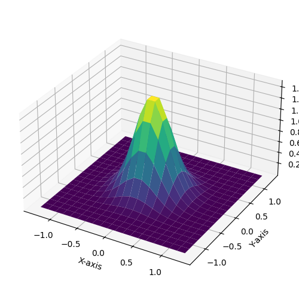
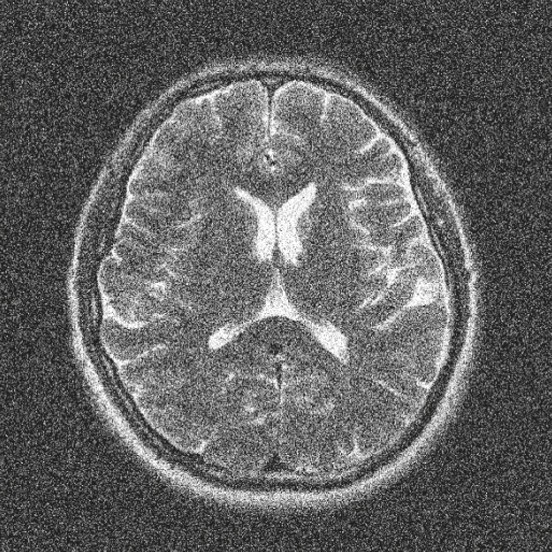
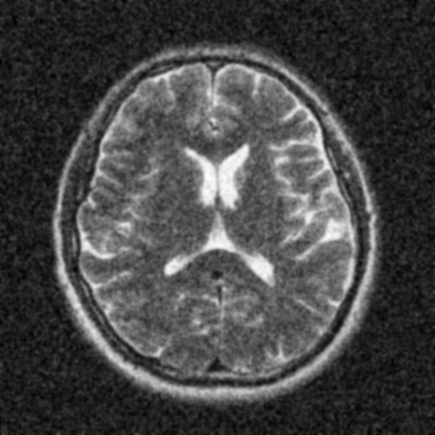
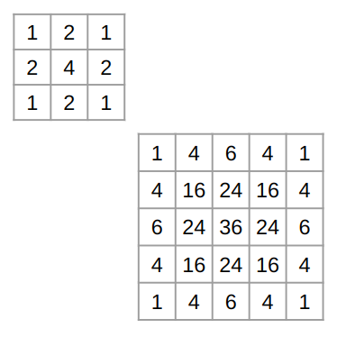
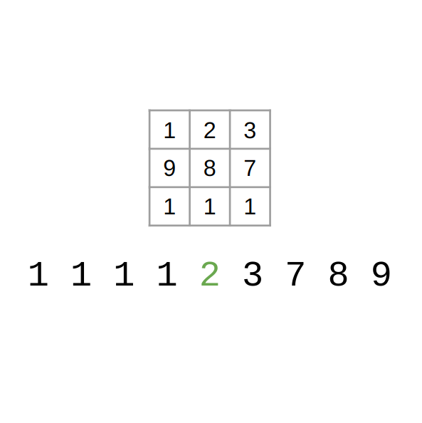
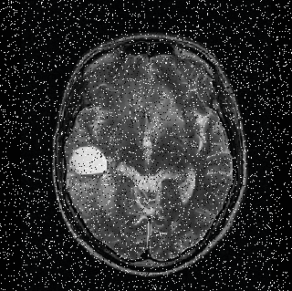
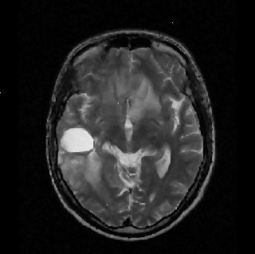
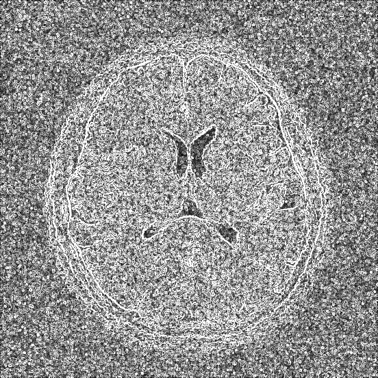

# ITK Explore

This repository contains the code base of the ITK assignment under the University of Moratuwa, In19-S7-BM4301 Medical Image Processing module. The primary task of this assignment was to explore the Insight Toolkit which is a commonly used software in the field of medical image processing. The students were expected to refer to the [ITK Software Guide](https://itk.org/ItkSoftwareGuide.pdf) and present the mathematics and usage behind its functionalities.

The sections explored in this repository are,

1. Smoothing operations
2. Registration operations
3. Filter Writing method
4. Module Writing method

The file structure of this repository is as follows:

```txt
.
├── assets # images used for the operations
├── exports # images exported by the operations
├── figures # figures used for the presentation purpose
├── itk-explore.ipynb # the main notebook for the exploration
├── presentation-figures.ipynb # notebook to create presentation figures
├── ReadMe.md
└── src # the directory holding the main source codes
```

The Google Slides version of the presentation slides can be found [here](https://docs.google.com/presentation/d/1CKnHkGXd33JYt6-Hrivo2-3FxPTaRBSfqOVhkUld6k8/edit?usp=sharing). The PDF version of the presentation slides can be found [here](https://drive.google.com/file/d/1lG0ZA82BygIyl7JY9oD_8BtZ-dDLg5in/view?usp=sharing).

## Smoothing Operations

ITK provides a number of smoothing operations to remove noise from images for the enhancement of visibility. These operations are mentioned under Book 2, Section 2.7 in the ITK Software Guide.

These operations are primarily done by convolving a given image with a kernel, which applies a weighted average to each pixel and its neighboring pixels, resulting in a softened and blurred effect.

The smoothing operations provided by ITK can be divided into two main groups.

1. Primitive Smoothing
2. Edge Preserving Smoothing

### Primitive Smoothing

Out of the many primitive smoothing operations provided by ITK, the following operations were analyzed;

1. Discrete gaussian blurring
2. Binomial blurring
3. Median blurring
4. IIR blurring

#### Discrete gaussian blurring

Discrete Gaussian blurring is widely regarded as one of the most fundamental and commonly employed techniques for image blurring. This method is favored for its exceptional characteristics. Read more at [Wikipedia](https://en.wikipedia.org/wiki/Gaussian_filter). The used kernel can be mathematically modeled by the equation below;

$$
g(x,y)=\frac{1}{2\pi\sigma^2}e^{-\frac{(x-\mu_x)^2+(y-\mu_y)^2}{2\sigma^2}}
$$

[ ](figures/gaussian-kernel.png "Gaussian Kernel")
[](assets/brain-noise.png "Original image")
[](exports/bluring/brain-noise[discrete-gaussian].png "Kernel applied image")

#### Binomial blurring

Binomial blurring is usually an iterative process. At a higher number of iterations, the operation becomes closer to the Gaussian operation. The kernel has the coefficients of the binomial expansion ($(a+b)^n$). These coefficients are scaled by a common factor so that the sum of all the terms of the kernel is equal to $1$.

[ ](figures/binomial-kernel.png "Unscaled kernels of size 3 and 5")
[](assets/brain-noise.png "Original image")
[](exports/bluring/brain-noise[binomial].png "Kernel applied image")

#### Median blurring

Median blurring is suitable when the input image has impulsive noise (e.g., salt and pepper noise). This operation selects the median value under the kernel in the input image and returns that to the output image. Read more at [Wikipedia](https://en.wikipedia.org/wiki/Median_filter).

[ ](figures/median-kernel.png "Unscaled kernels of size 3 and 5")
[](assets/brain-noise-salt.png "Original image")
[](exports/bluring/brain-noise-salt[median].png "Kernel applied image")

An example of a median in filter operation Original image Kernel applied image

### Edge preserving smoothing

Out of the many edge-preserving smoothing operations provided by ITK, the following operations were analyzed.

1. Gradient anisotropic diffusion
2. Curvature anisotropic diffusion

The basic idea behind edge-preserving smoothing is to somehow apply the blurring operation only to regions without edges.

#### Gradient anisotropic diffusion

This method calculates the gradient of the given image and uses it as the mask for the blurring operation. This is an iterative process. This method was initially proposed by Perona and Malik in 1990. Read more in the [original paper](https://ieeexplore.ieee.org/document/56205). The key mathematical formulation can be presented as;

$$
\frac{\partial I}{\partial t}=div(c(x,y,t)\nabla I)=\Delta c.\nabla I+c(x,y,t)\Delta I \\
c(||\nabla I||=e^{-(||\nabla I||/K)^2})
$$

[](assets/brain-noise.png "Original image")
[ ](figures/brain-gradients.png "Gradients")
[](exports/bluring/brain-noise[grad-anisotropic-diffusion].png "Blurred image")

# Registration

Registration is the process of overlapping visual entities (images or 3D volumes) on top of each other for the purpose of processing or analysis. The implementation in ITK is documented under Book 2, Section 3 of the ITK Software Guide.

A typical registration framework will look like the following

")

Here there are two images; a _Moving Image_ and a _Fixed Image_.

1. The _Transformer_ applies a transformation to the moving image.
2. The _Interpolator_ interpolates the transformed moving image at the pixel locations of the fixed image.
3. The _Metric_ compares the similarity between the fixed image and the moving image.
4. The _Optimizer_ iteratively adjusts the parameters of the Transform to minimize the distance resulting from the Metric.

In this scenario, the user is forced to do the interpolation in the domain of the Fixed Image. This might impose unwanted restraints in certain scenarios. Therefore, the ITKv4 registration framework provides an additional option to apply a transformation to the fixed image too. This transformation will remain the same throughout the iterative process.

")
")

# Filter Writing

Filter objects map operations throughout a given image. ITK provides a number of filters out of the box. To make the usage more flexible, the ITK Software Guide provides further instructions to write custom filters as per requirement. This is documented in Book 1, Section 8 of the ITK Software Guide.

## Basic Architecture of ITK Filters

")

ITK Filters are built with a “Pipeline” architecture through which data is streamed. The data starts at _Sources_ (e.g., ImageReader…) and ends at _Mappers_ (e.g., ImageWriter, Display,...). A pipeline is an interconnection of _ProcessObjects_ and _DataObjects_. In the code implementations, they are instantiated with the definition of input and output types.

")

## Pipeline functions

1. _Filter Selection and Execution_: Determining the filters that need to be executed to minimize redundancy and reduce overall execution time.
2. _Initialization and Memory Allocation_: Preparing filter output data objects and managing memory allocation for efficient data processing.
3. _Data Processing Determination_: Assessing the amount of data processing required, accounting for memory constraints, and addressing kernel size effects.
4. _Data Subdivision for Multi-Threading_: Dividing data into subpieces to facilitate multi-threading and enhance performance.
5. _Dynamic Data Management_: Managing the release of output data and utilizing filter caches for optimized downstream processing.

## Sequence of Operation

")

The execution of a filter operation is initialized by the `DataObject::Update()` method at the required DataObject. This internally invokes,

1. `DataObject::UpdateOutputInformation()`
2. `DataObject::PropagateRequestedRegion()`
3. `DataObject::UpdateOutputData()`

### `DataObject::UpdateOutputInformation()`

-   Information is metadata of the DataObject (origin, spacing, and LargestPossibleRegion…)
-   Updates the information in dataobjects
-   Also verifies parameters are valid and consistent
-   Invokes `ProcessObject::GenerateOutputInformation()`

### `DataObject::PropagateRequestedRegion()`

-   Configuring the filter’s input and output process object’s to the correct size (setting BufferRegion)
-   Invokes `DataObject::PropagateRequestedRegion()` that can be overloaded

## `DataObject::UpdateOutputData()`

-   Compares modified time, pipeline time, release data flag, and valid requested region
-   If regeneration is required, delegates the task to `ProcessObject::UpdateOutputData()`
    -   Internally invokes `GenerateData()` that can be overloaded

## Creating a filter

There are two methods to create a filter. Depending on the fine grab of the underlying functionalities, the user may select one of the following

1. Creating a composite filter
2. Extending a base class

### Creating a composite filter

")

Connect the inputs and outputs of multiple filters appropriately.

### Extending a base class

There are two major steps in this process

1. The extended class must expose public types for the class itself (Self) and its Superclass, and const and non-const smart pointers. For example:

    ```cpp
    using Self = CompositeExampleImageFilter;
    using Superclass = ImageToImageFilter<TImage, TImage>;
    using Pointer = SmartPointer<Self>;
    using ConstPointer = SmartPointer<const Self>;
    ```

    ITK provides many base classes:

    - ImageToImageFilter
    - UnaryFunctorImageFilter
    - BinaryFunctorImageFilter
    - ImageFunction
    - MeshToMeshFilter
    - LightObject

2. Override the required methods.

# Module writing

Due to the larger community of developers, the community itself has come up with a basic architecture to Modularize source codes to organize functionalities in a modular architecture. ITK uses CMake to build the source codes. All the steps are documented in detail in Book 1, Section 9 of the ITK Software Guide.
